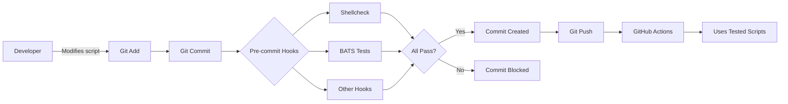

# Testing Framework Documentation

This document describes the testing framework for GitHub Actions workflows and CI scripts.

## Overview

The project uses **BATS** (Bash Automated Testing System) to test shell scripts used in GitHub Actions workflows. Tests run automatically via pre-commit hooks when shell scripts are modified.

## Quick Start

### Install BATS

```bash
./scripts/local/install-bats.sh
```

### Run Tests

```bash
# Run all workflow tests
bats tests/workflows/

# Run specific test file
bats tests/workflows/retry-utils.bats

# Verbose output with TAP format
bats --tap tests/workflows/retry-utils.bats
```

### Pre-commit Integration

BATS tests run automatically when you commit changes to shell scripts in `scripts/ci/`:

```bash
# Tests run automatically on commit
git add scripts/ci/retry-utils.sh
git commit -m "Update retry logic"

# Run manually
pre-commit run bats-tests --all-files
```

## Test Structure

### Retry Utilities (`retry-utils.bats`)

Tests the `retry_azure_operation` function in `scripts/ci/retry-utils.sh`:

| Test | Description |
|------|-------------|
| `retry succeeds on first attempt` | Verifies successful command execution |
| `retry succeeds on second attempt` | Tests retry with recovery |
| `retry fails immediately on permanent error` | Validates permanent error detection |
| `retry fails after max attempts` | Confirms retry limit enforcement |
| `retry recognizes rate limit error` | Tests 429 error detection |
| `retry recognizes service unavailable error` | Tests 503 error detection |
| `retry uses exponential backoff` | Verifies backoff logic exists |
| `retry captures command output correctly` | Tests output capture |
| `retry preserves multi-line output` | Tests multi-line output handling |

### Error Types Recognized

The retry function detects and properly handles:

- **Permanent Errors** (no retry):
  - `AuthorizationFailed`
  - `InvalidAuthenticationToken`
  - `Forbidden`
  - `InvalidResourceGroupName`

- **Transient Errors** (retry with backoff):
  - `TooManyRequests` / `429` - Rate limiting
  - `ServiceUnavailable` / `503` - Service unavailable
  - `GatewayTimeout` / `504` - Timeout
  - `InternalServerError` / `500` - Server error
  - `Conflict` / `409` - Resource conflict

## Writing New Tests

### Test Template

```bash
#!/usr/bin/env bats

setup() {
  # Runs before each test
  source scripts/ci/retry-utils.sh
  export RETRY_BASE_DELAY=0  # Speed up tests
}

@test "description of test" {
  run command_to_test arg1 arg2
  [ "$status" -eq 0 ]
  [[ "$output" == *"expected text"* ]]
}
```

### Best Practices

1. **Speed up tests**: Set `RETRY_BASE_DELAY=0` to skip sleep delays
2. **Use `[[ "$output" == *"text"* ]]`**: Tests for substring presence (handles stderr messages)
3. **Test both success and failure paths**: Verify correct behavior in all scenarios
4. **Use descriptive test names**: Make failures easy to understand
5. **Clean up temp files**: Remove any temporary files created during tests

## Integration with Workflows

The deployment workflow uses the tested retry utilities:

```yaml
- name: Setup retry utilities
  shell: bash
  run: |
    # Copy retry utilities from source
    cp scripts/ci/retry-utils.sh /tmp/retry-utils.sh
    chmod +x /tmp/retry-utils.sh

- name: Deploy
  run: |
    source /tmp/retry-utils.sh
    retry_azure_operation 5 "Deploy resources" az deployment group create ...
```

## CI/CD Pipeline



## Pre-commit Hook Configuration

The BATS hook in `.pre-commit-config.yaml`:

```yaml
- id: bats-tests
  name: BATS Tests
  entry: >
    bash -c '
    if command -v bats &> /dev/null; then
      bats tests/workflows/;
    else
      echo "BATS not installed, skipping tests. Install: ./scripts/local/install-bats.sh";
    fi'
  language: system
  files: ^scripts/ci/.*\.sh$
  pass_filenames: false
  verbose: true
```

**Behavior:**
- Triggered by changes to `scripts/ci/*.sh`
- Runs all tests in `tests/workflows/`
- Gracefully skips if BATS not installed
- Shows verbose output for debugging

## Testing Framework Benefits

✅ **Catch bugs before deployment**: Tests run locally before code reaches CI/CD
✅ **Fast feedback**: Tests complete in ~0.5 seconds
✅ **Comprehensive coverage**: Tests success paths, error handling, and edge cases
✅ **Easy to extend**: Add new tests by following the template
✅ **Integration with existing hooks**: Works alongside Pester, PSScriptAnalyzer, etc.

## Resources

- [BATS Documentation](https://bats-core.readthedocs.io/)
- [GitHub Actions Documentation](https://docs.github.com/en/actions)
- [Pre-commit Framework](https://pre-commit.com/)
- [Project Testing Documentation](./CODE_QUALITY.md)
